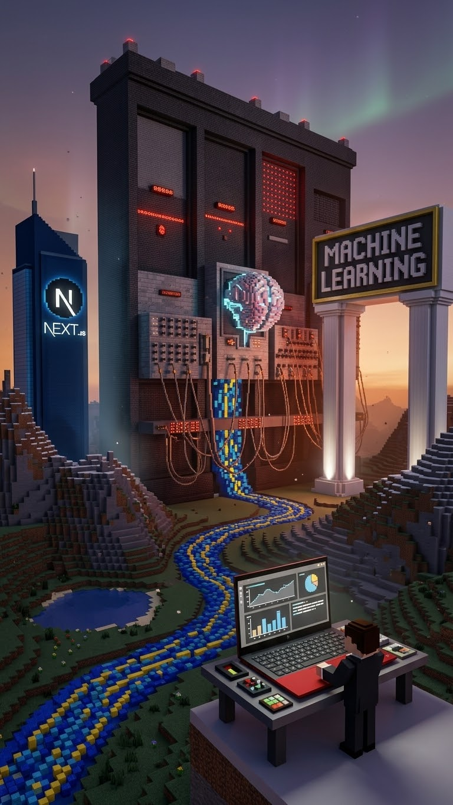

<p align="center">
  
</p>

# 🚀 ML-x


## 💻 Tech Stack

### Core Programming Languages, Core Systems
*   **Go:** High-concurrency backend microservices, networking, and system daemons.
*   **Rust:** High-performance systems programming, memory safety, and core processing engines.
*   **Python:** Machine learning pipelines, data processing scripts, and automation hooks.
*   **TypeScript:** Type-safe frontend client architectures and UI logic.
*   **Shell Scripting:** System automation, daemon deployment, and shell orchestration.

### Platform Support & Hardware Architecture
*   **Linux:** Primary container and server runtime target.
*   **Mobile / Android:** Cross-platform local development and mobile-first workflow management.
*   **x86_64 / ARM64:** Multi-architecture binary compilation and deployment support.

### Low-Level Infrastructure & Performance
*   **Docker & Docker Compose:** Containerization, image publishing, and multi-service orchestration.
*   **Kubernetes:** Cluster management and container scaling for distributed workloads.
*   **Terraform:** Declarative infrastructure-as-code (IaC) for multi-cloud resource provisioning.

### Cybersecurity & Offensive Auditing
*   **Aegis & Vul Frameworks:** Automated vulnerability scanning, CVE indexing, and secure worker pools.
*   **RedTeam Tooling:** Custom security auditing suites and crate management utilities.

### DevOps & Build Tools
*   **GitHub Actions:** Continuous integration, testing pipelines, and automated artifact publishing.
*   **Cargo & npm:** Package management for Rust and TypeScript modules.

### Kivy
*   **Kivy:** Cross-platform Python UI framework for interactive, touch-enabled client applications.

### Artificial Intelligence & Quantum
*   **PyTorch:** Deep learning framework for training and executing custom neural models.
*   **Multi-Agent Pipelines:** Orchestration frameworks integrating foundational AI models (Gemini Pro Thinking, Claude Code, OpenAI Codex, and ChatGPT) into unified workflows.

### Cloud Providers
*   **Google Cloud Platform (GCP):** Cloud infrastructure, computing, and remote execution environments (Google Cloud Shell).

---

Imagine you are running a giant high-tech theme park. The **frontend** is the colorful ticket booth and fun rides everyone can see, the **backend** is the hidden engine room keeping everything running smoothly, and **Terraform** is the magic construction crew that instantly builds the entire park grounds anywhere you want. **ML-x** is the master blueprint that packs all of this together into a single box so you can spin up the whole system anywhere with one click!

## 🎯 What this is?
**ML-x** is a fully containerized, cloud-provisioned full-stack architecture framework. It couples a robust backend service with an interactive frontend, automated infrastructure provisioning via Terraform, and high-performance system integrations.

## ⚙️ What this does?
*   **Orchestrates Services:** Links containerized backend APIs and frontend user interfaces seamlessly using Docker Compose.
*   **Automates Infrastructure:** Provisions cloud and server environments declaratively using infrastructure-as-code scripts.
*   **Executes Workflows:** Powers multi-language modules across Go, Rust, and Python to handle heavy processing and automated tasks.

## 🧠 How does this work?
1.  **Provision:** Terraform prepares the baseline environment and infrastructure configuration.
2.  **Containerize:** Docker packs the application services using the root `Dockerfile` and dependency trees.
3.  **Execute:** The backend and frontend communicate across isolated networks to serve data and process requests.

## 🛠️ What problems this solves?
*   **Environment Mismatches:** Stops the classic "it works on my machine" headache by locking dependencies down in standard containers.
*   **Tedious Infrastructure Setup:** Eliminates manual server configuration through automated code-driven provisioning.
*   **Fragmented Codebases:** Unifies system logic, UI components, and infrastructure definitions into a clean, predictable layout.

## 🔥 Why is this cool?
It bridges the entire gap from code to cloud. You don't just get an app template—you get a complete production-grade system setup backed by high-performance toolchains, multi-agent AI pipeline support, and instant deployment capabilities.

## 📋 What is the requirements?
*   **Docker & Docker Compose:** Latest stable release
*   **Terraform:** v1.0+
*   **Node.js / npm:** v18+ (for frontend and package tracking)
*   **Python / Go / Rust:** Runtimes corresponding to their respective pipeline components
*   **OS:** Linux, macOS, or Windows (WSL2 recommended)

## 💻 How to install this?
```bash
# 1. Clone the repository
git clone [https://github.com/darnellwashingtonjr94-art/ML-x.git](https://github.com/darnellwashingtonjr94-art/ML-x.git)

# 2. Navigate into the directory
cd ML-x

# 3. Spin up the entire stack with Docker Compose
docker-compose up --build

ML-x/
├── .github/                # CI/CD workflows and automated pipelines
├── backend/                # Server-side application logic, APIs, and data handlers
├── frontend/               # Client-side user interface code
├── terraform/              # Infrastructure-as-Code configuration files
├── .dockerignore           # Files to exclude from Docker builds
├── .gitignore              # Files to exclude from Git tracking
├── Dockerfile              # Container build instructions for the application stack
├── README.md               # The top-level project documentation (you are here)
├── docker-compose.yml      # Multi-container orchestration definition
└── package-lock.json       # Locked dependency tree for JavaScript/Node modules
